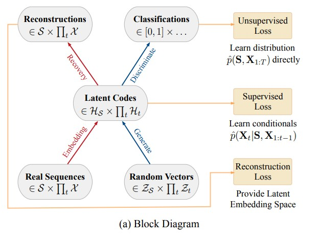
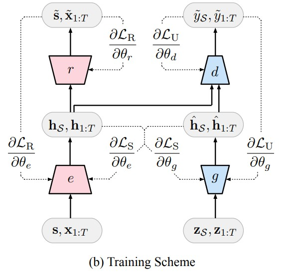
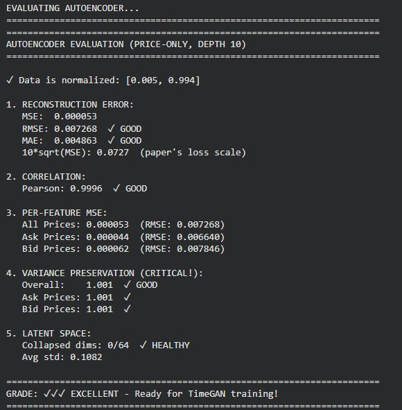
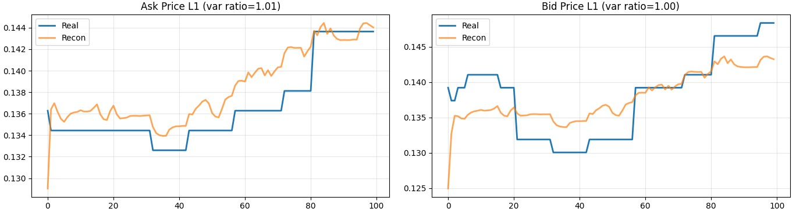
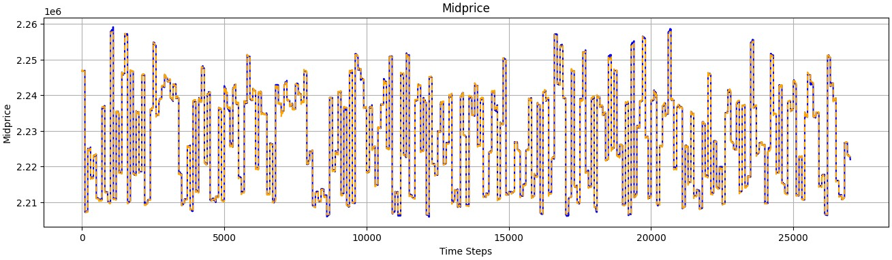
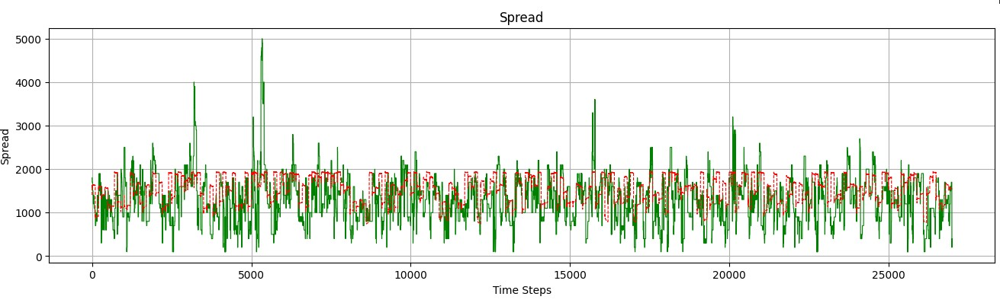
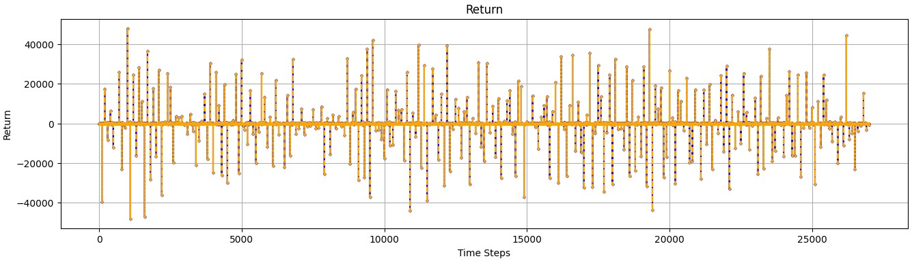

# TimeGAN for Synthetic LOBSTER Financial Data Generation

# Background
Generative Adverarial Networks have emerged as one of the more popular machine learning frameworks in recent years, given
the increasing desire for generative AI, and synthetic data producttion. Popular networks such as the StyleGAN and widely reknowned
transformers such as ChatGPT have taken the world by storm, but both have unique weakness when it comes to handling time-series data.
Traditional GAN cannot capture the temporal dyamics of time-series data, and transformers are purely deterministic, not built for syntethic data generation. In 2020 a new model entered the atmosphere known as the TimeGAN, designed for synthetic data generation, focusing on temporal data dynamics, through the addition of supervised losses.

# Algorithm Description and Architecture

TimeGAN is designed around the basic unsupervised GAN setup, with the addition of a supervisor loss as used in
autoregressive models. There are 4 main components: Autoencoder, Supervisor, Generator,
and Discriminator. 

AutoEncoder: Split into a traditional embedder and recovery structure, the implementation of the autoencoder
             can be parameterised by any model as long as it is autoregressive and 'obeys casual
             ordering.' Our autoencoder uses 3 stacked GRU layers, and a fully connected layer for
             both the embedder and recovery components. The autoencoder aims to condense the high-
             dimensional time-series data to a lower-dimensional latent space.

Supervisor: This component is what makes the TimeGAN understand complex time-step relationships
            within time-series data. It is parametires by 2 stacked GRU layers, and a dense
            fully connected layer. Given a sequence of timesteps inside the latent space, 
            it is trained to predict the next step inside the latent space for each timestep, 
            in the sequence. 

Generator: The generator takes random noise in the shape of the latent space, and generates
           a synthetic sample within the latent space. The random noise is generated via the
           Weiner process, which adheres to temporal behaviour. It is also built on
           3 stacked GRU layers with a fully connected layer.

Discriminator: The discriminator also operates in the embedding space, and attempts to
               distinguish between real and fake data sequences. It is also built on
               3 stacked GRU layers with a fully connected layer.

# Data Preprocessing

We are using a LOBSTER formatted dataset for Amazon stock (level 10 depth), initially I tried mapping volume, 
but soon realised this task is extreme, and instead cut volume and focused on price. Min-max scaling was used
for normalisation as per the original paper, and numerous other resources. Z-score was also tested but min-
max scaling managed to keep the shape of the data better. To avoid data leakage the min-max scaling was applied
using the minimum maximum values for the combined training/validation data. This ensures that the test data does
not contain future information, being the global min max values. Since we are operating with a single day of
stock data, it was important to shuffle the dataset so there is equal representation in each dataset, for each
part of the day.

# Training Process

Opposed to traditional epoch training, the original paper uses a random batch generator focusing
on generalisation. Seen in the 'utils.py' file, the batch generator allows repeat sequences, and
does not guarantee that every sequence is seen, by randomly selecting via permutations. 

The autoencoder is pretrained under reconstruction loss (supervised loss introduced later). As we 
are trying to maintain the financial indicators midprice, and spread, I also included additional
loss values for those specifically as well as a variance loss. Later on you will see the original
paper uses a two moments loss to ensur the variance of a sequence is maintained. I also decided to
use this in the autoencoder training, so that the embeddings did not 'stick to the mean'. A 
hidden dimension of 64 and sequence length of 100 was the final choice (under 8000 iterations), 
the original paper also did not opt for a bottleneck having more hidden_dimensions then the feature
space as well. 

The supervisor is also pretrained. The embedder is used on a batch of data, 
it is then passed through our supervisor, and the predicted time steps are compared under mean
squared error. Additionally, the generator's trainable variables are also nudged using the resulting
gradients (as per the original paper). This ensures the generator is initialised with some temporal 
knowledge before adversarial training. 

Joint training is our final stage of training where the TimeGAN starts to take place. As per figure b,
each component has it's relevant losses. 

## Generator
The generator has a 'unsupervised loss' and a 'supervised loss'.
A batch of data is embedded, and then ran through the supervisor, both of these latent embeddings make
up the supervise loss. 

The process of calculating our unsupervised loss begins with a random noise vector being inputted into 
the generator which then outputs a synthetic sample in the embedded space. This synthetic sample is 
then parsed though the supervisor, and then the recovery component of the autoencoder. 

We then seperately parse the synthetic embedding and the supervised synthetic embedding into the
discriminator, and the summation of these two binary cross entropy losses make up the 
generator's unsupervised loss. There is also an additional moment loss for the generator which
is not shown in figure b, but mentioned in the paper. It is added to try and maintain the statistical
properties of the original batch (variance and mean).

It should also be noted that this generator training occurs twice in each loop in an attempt to give
the generator an advantage over the commonly overpowering discriminator.

## Autoencoder
The embedder and recovery components are also included in the generator training loop, this time not
just under the pretrained reconstruction loss, but is also introduced to the supervised loss.

## Discriminator
The discriminator is provided with a real sample and a synthetic example from the generator, and it's
total loss function is the summation of the bce results for both samples. If the total discriminator
loss drops below 0.15 then the training is skipped this iteration, as to allow the generator to catch
up (constant pulled from original paper).

# Results and Visualisations (AutoEncoder)

NOTE: All visualisation code was assisted by Claude.Ai

Above are some meaningul statistics for our pre-trained autoencoder performance. I was particularly
focused on variance preservation as the autoencoder tends to hug the mean of the sequence price
instead of fitting the data.

Above are the reconstructions for a randomly chosen sequence, showing the original and 
reconstructed bid/ask prices. It shows the autoencoder is slowly learning the structure of
the data and maintaining it's variance.

Above are the denormalised plots of the financial indicators, reconstructed by our autoencoder, 
over the entire validation set. The midprice and return seem very reliable but the autoencoder
has trouble mapping the spread feature.

# Results and Visualisations (TimeGAN)

# Discussion

Unfortunately due to time constraints and computing restrictions the results of the TimeGAN are 
neither a success or a failure, but incomplete. The autoencoder could only be trained for 8000
iterations and the TimeGAN for 1000 iterations (2 hours), opposed to the original paper's 50,000 
for both. Therefore it is hard to tell if my architecture is inherently flawed or if it just 
was not given the time. Initially I planned to first train the TimeGAN with purely adversarial
loss but only supervised assisted training was executed. 

# Training Specifications (GPU, VRAM, etc.)

Here are the approximate parameter counts assuming a hidden_dimension=64, num_layers=3, 
num_features=20 for all architectures:

Embedder: 70,016
Recovery: 75,604
Supervisor: 53,696
Generator: 78,464
Discriminator: 74,369

TOTAL: 352, 149

The entire project was created and trained using google colab's A100 GPU.

## Current Dependencies Required:

- numpy
- tensorflow
- scikit-learn 
- os (colab usage)
- drive (colab usage)
- matplotlib
- from scipy.stats import pearsonr

## References
https://numpy.org/doc
https://www.tensorflow.org/api_docs/
https://proceedings.neurips.cc/paper_files/paper/2019/file/c9efe5f26cd17ba6216bbe2a7d26d490-Paper.pdf
https://github.com/jsyoon0823/TimeGAN
https://lobsterdata.com/info/DataSamples.php
https://ydata.ai/resources/synthetic-time-series-data-a-gan-approach
https://notes.yeshiwei.com/_downloads/2ce792aff8596ea9453a9714f39d957a/Machine_Learning_for_Algorithmic_Trading_Predictive.pdf
https://github.com/stefan-jansen/machine-learning-for-trading/tree/main
https://repository.lib.fsu.edu/islandora/object/fsu:770676
https://bechirtr97.medium.com/enhancing-timegan-with-language-model-architectures-autoregressive-transformers-and-positional-bc6a7024e047
https://www.jpmorgan.com/content/dam/jpm/cib/complex/content/technology/ai-research-publications/pdf-12.pdf
https://www.tensorflow.org/guide/migrate#migrate-from-tensorflow-1x-to-tensorflow-2
https://github.com/Jeonghwan-Cheon/lob-deep-learning
https://arxiv.org/abs/1808.03668?utm_source=chatgpt.com
https://link.springer.com/article/10.1007/s10462-024-10715-4?utm_source=chatgpt.com